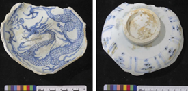

# 14th century shipwreck reveals huge cargo of rare Yuan Dynasty blue-and-white porcelain

*By  Issy Ronald  Updated Mar 2, 2026*
*Source:[Record haul of rare Yuan Dynasty blue-and-white porcelain discovered at shipwreck off Singapore | CNN](https://edition.cnn.com/2026/02/28/science/yuan-dynasty-porcelain-singapore-shipwreck-intl-scli)*

<figure class="img-center">
  
  <figcaption>The blue-and-white porcelain is intricately decorated. Michael Flecker/Science Direct</figcaption>
</figure>

In the waters off Singapore, a recently uncovered a[^1] shipwreck with a huge cargo of blue-and-white porcelain is shedding light on[^2] the storied Chinese craft produced during the turbulent[^3] era of the Mongol Empire.

The roughly 650-year-old ship, which was likely sailing from China to Temasek, a historic settlement on the site of modern-day Singapore, contained a record haul[^4] of Yuan Dynasty porcelain, according to the paper that detailed its discovery.

It took Michael Flecker, the marine archaeologist who led the investigation, and his team four years to sift through the site of the 14th century wreck and recover the remnants of the ship's cargo.

The researchers found roughly 3.5 metric tons of ceramic shards[^5], about 136 kilograms (about 300 pounds) of which was Yuan porcelain – that distinctive blue-and-white, intricately[^6] patterned ceramic, as well as several intact or nearly intact porcelain pieces.

Although the wreck site was shallow, the researchers battled "strong currents and associated shocking visibility," meaning they could only dive about once every four weeks, Flecker told CNN.

"Even then, we were occasionally sent tumbling along the seabed or groping our way back to the diver down-line in darkness," added Flecker, a senior archaeologist at Heritage SG, a subsidiary of the Singapore National Heritage Board.

In such conditions, the vessel itself mostly disintegrated, though Flecker suspects it was likely a Chinese junk, a type of sailing ship widely used in the early Middle Ages.

Scant artifacts survived those conditions, and almost all the porcelain recovered from the site consisted of shards. Still, enough intact objects survived to identify the telltale designs.

One features a four-clawed dragon; another depicts a phoenix surrounded by a band of chrysanthemums.

The recurrence of one particularly popular design – mandarin ducks in a lotus pond – even allowed Flecker to date the shipwreck.

That design was the signature motif of Emperor Wenzong, who restricted it for his personal use during his reign from 1328 to 1332, according to the study. Those restrictions likely ended once he was deposed[^7], meaning that commercial kilns[^8] produced many more ceramics featuring this motif, much of which was exported, Flecker said.

The imperial kilns were likely shut down about 20 years later, following the invasion of the Red Turbans, a peasant rebellion movement, narrowing the window in which this ship could have sunk.

Even if some kilns had continued producing ceramics, the Yuan Dynasty fell in 1368 and the first Ming emperor banned commercial trade around 1371, so even conservative estimates for dating the shipwreck still fall between the late 1320s and 1371, according to the study.

## 'Miraculous'[^9] material

During the time Yuan porcelain was produced, it became coveted[^10] by elites across Eurasia, said Shane McCausland, professor of the history of art at SOAS University of London (formerly the School of Oriental and African Studies) who wasn't part of the study.

"This is crockery, it's not prized in the same way as gold, painting, calligraphy or the greatest architecture," he told CNN. "Yet, it's something to do with the translucency[^11], the incredible hardness of it, it's a kind of material that is a bit miraculous.

"There's even a belief that it has magical properties that if you put poison on it, it would crack … that partly explains why paranoid rulers would like to have a bit of blue-and-white," he added.

The porcelain also illuminates the nature of the trade networks that existed at the time – it was made by Chinese craftsmen, utilizing cobalt that originated from Persia, now modern-day Iran, before being exported along the continental and maritime silk routes, which the Mongols dominated, McCausland said.

For him, Yuan porcelain represented a major cultural and technological breakthrough in Chinese art under Mongol rule, countering long-running, orthodox perceptions[^12] of the imperial dynasty.

"As soon as the Mongols retreated from China in 1368, the knowledge that this blue-and-white was a breakthrough of the Yuan period got lost," he said.

As late as the 1930s, scholars would misidentify the porcelain as produced by other dynasties. "In other words, what could the Mongols have had to do with this? They destroyed, they raped, they pillaged[^13]," he said.

This particular shipment likely set sail from Quanzhou, a port on China's eastern coast that was close to the creative heartlands in the Fujian, Zhejiang and Jiangxi provinces, bound for Temasek, according to Flecker.

While historians already knew Temasek was an important duty-free port during the 14th century, this shipwreck "hints at the extent of local consumption" and "demonstrates the wealth" of the settlement, Flecker said.

The study was published in June 2025 in the Journal of International Ceramic Studies.
(829 words)

[^1]: 原文此处的'a'似乎是多余的。

[^2]: shed light on:  
阐明 (idiom) To reveal information about something or make it easier to understand.  

[^3]: turbulent:  
动荡的 (adjective) Characterized by conflict, disorder, or confusion; not stable.  

[^4]: haul:  
(1) 拖，拉，拽 (verb) Pull something heavy slowly and with difficulty / Take something or someone somewhere, especially by force  
(2)（赃物或非法物品的）一大批，大量 (noun) A usually large amount of something that has been stolen or is illegal  
(3)（鱼的）捕获量 (noun) The amount of fish caught  

[^5]: shards:  
碎片 (noun) Pieces of broken ceramic, glass, or metal.  

[^6]: intricately:  
精细地 (adverb) In a very detailed or complicated manner.  

[^7]: depose:  
废黜 (verb) Remove someone from power suddenly and forcefully.  

[^8]: commercial kiln:  
商业窑 (noun) A factory or an oven used for firing pottery for business and trade purposes.  

[^9]: shards:  
碎片 (noun) Pieces of broken ceramic, glass, or metal.  

[^10]: coveted:  
令人垂涎的 (adjective) Greatly desired or envied.  
Covet:  
贪求；觊觎 (verb) Want to have something very much, especially something that belongs to someone else.

[^11]: translucency:  
半透明 (noun) The quality of allowing light to pass through, but not detailed images.

[^12]: orthodox perceptions:  
正统观念 (noun) Traditional or generally accepted views or beliefs.

[^13]: pillage:  
掠夺 (verb) Rob or steal good